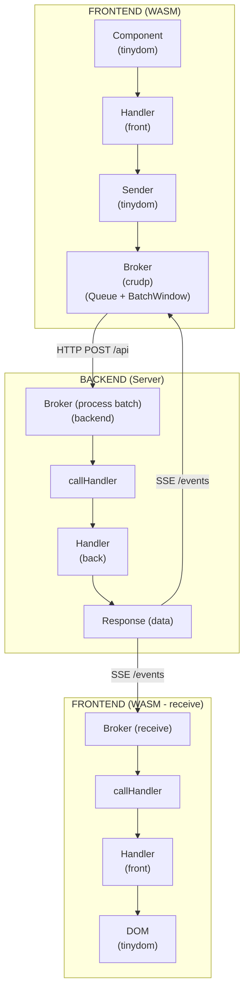

# CRUDP Architecture

> **Status:** Specification Document  
> **Last Updated:** December 2024

## Overview

CRUDP (CRUD Protocol) is a binary/JSON protocol for isomorphic Go applications, enabling seamless communication between WASM frontend and Go backend using the same handler logic on both sides.

## Core Principles

1. **Isomorphic Handlers:** Same handler code runs on frontend (WASM) and backend (Server) with build tags
2. **Zero Framework Coupling:** Handlers don't import CRUDP, only implement simple interfaces
3. **Batch Processing:** Multiple operations consolidated into single HTTP requests
4. **SSE Responses:** Server-Sent Events for async response delivery
5. **TinyGo Compatible:** No maps in hot paths, minimal allocations

## Architecture Diagram



## Key Decisions

| Decision | Choice | Rationale |
|----------|--------|-----------|
| Serialization | JSON (tinyjson) default, binary optional | SSR compatibility, tinyjson optimized for WASM |
| Handler signature | `func(ctx, data ...any) any` | Simple, supports batch data, frontend returns nil |
| Packet structure | 1 Packet = N data items (Data [][]byte) | Efficient bulk operations, multiple responses |
| Batching | Consolidate by Handler+Action | Reduce HTTP requests |
| Message types | `tinystring.MessageType` (uint8: 0-4) | Replaces bool Success, 5 states (Normal, Info, Error, Warning, Success) |
| HTTP methods | POST/GET/PUT/DELETE → c/r/u/d | Standard REST mapping |
| HandlerName | Optional via reflection + SnakeLow() | Fallback to `reflect.TypeOf().Name()` converted to snake_case |
| Logger | Configured via method, not Config | `SetLogger()`/`DisableLogger()` avoid nil checks |

## Implementation Steps

| Step | Status | Document | Description |
|------|--------|----------|-------------|
| 1 | 🔄 Pending | [STEP_01](issues/STEP_01_PACKET_STRUCTURE.md) | PacketResult with MessageType and Data [][]byte |
| 2 | 🔄 Pending | [STEP_02](issues/STEP_02_HANDLER_REGISTRATION.md) | Handler name via reflection, Validator, return `any` |
| 3 | 🔄 Pending | [STEP_03](issues/STEP_03_CONFIG_SYSTEM.md) | Config with Codec interface (Logger via method only) |
| 4 | 🔄 Pending | [STEP_04](issues/STEP_04_BROKER_BATCHING.md) | Broker with consolidation and tinytime Timer |
| 5 | 🔄 Pending | [STEP_05](issues/STEP_05_UPDATE_EXISTING.md) | Update existing code and tests |

## Implementation Prompt

For LLM implementation, see: [PROMPT_IMPLEMENTATION.md](issues/PROMPT_IMPLEMENTATION.md)

## Dependencies

```
crudp
├── github.com/cdvelop/tinyjson   # Default codec (JSON)
├── github.com/cdvelop/tinystring # Errors, MessageType, SnakeLow
├── github.com/cdvelop/tinytime   # Timer for broker (WASM compatible)
└── github.com/cdvelop/fetchgo    # HTTP client (WASM)
```

## Key Interfaces

```go
// Response interface for routing (handlers can return this)
type Response interface {
    Response() (data any, broadcast []string, err error)
}

// CRUD interfaces (return any, not []any)
type Creator interface { Create(ctx context.Context, data ...any) any }
type Reader interface  { Read(ctx context.Context, data ...any) any }
type Updater interface { Update(ctx context.Context, data ...any) any }
type Deleter interface { Delete(ctx context.Context, data ...any) any }

// Optional interfaces
type NamedHandler interface { HandlerName() string }  // Override auto name
type Validator interface { Validate(action byte, data ...any) error }
type FieldValidator interface { ValidateField(fieldName, value string) error }

// Codec interface (tinyjson default)
type Codec interface {
    Encode(data any) ([]byte, error)
    Decode(data []byte, v any) error
}
```

## Test Pattern

Tests work in both environments using separate files:

```
*_shared_test.go  - Shared logic (no build tags)
*_stlib_test.go   - Backend entry (//go:build !wasm)
*_wasm_test.go    - WASM entry (//go:build wasm)
```

## Related Documentation

- [INTEGRATION_GUIDE.md](INTEGRATION_GUIDE.md) - How to integrate CRUDP
- [CONFIG.md](CONFIG.md) - Configuration options
- [LIMITATIONS.md](LIMITATIONS.md) - Supported data types

## External Dependencies

- **tinydom:** Sender interface, Form validation - See [tinydom/docs/ROADMAP.md]
