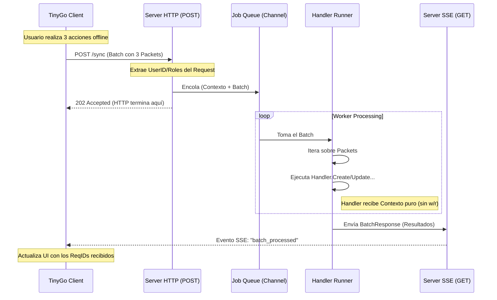
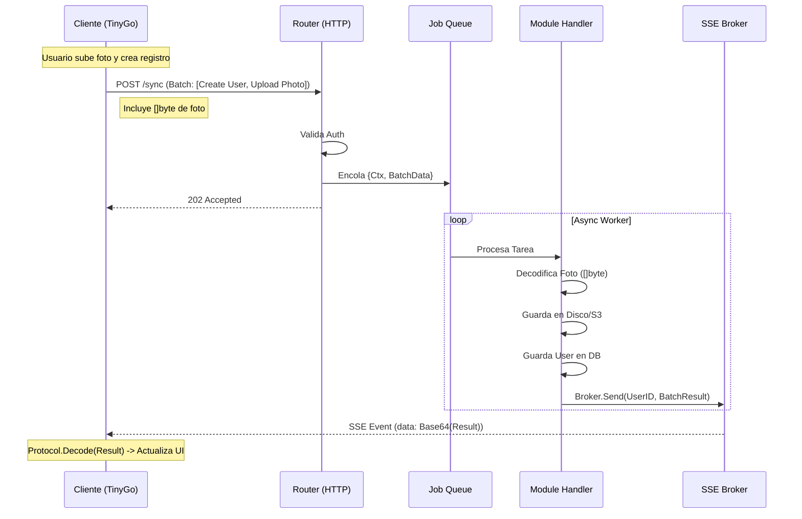

## DEV:
en el archivo [ARCHITECTURE_MODULAR](ARCHITECTURE_MODULAR) estoy intentando de crear una forma de registrar manejadores para las 4 operaciones basicas pero es limitado aun la idea es que el modulo tenga/retorrne N handlers y que cada Handlres su api tenga N endpoint, hay hanlders que solo procesan N archivos, otros que no por ende todos no necesitan recibir por parametro r y w. la idea es que se registren en router.go y este a su ves use [CRUDP](../README.md). [IMPLEMENTACION](./IMPLEMENTATION) crudp es un protocolo que estoy creando para simplificar la creacion de apis de forma tipada tanto el cliente.go y el server.go deben de conocer los handlres. las idea que los handlres siempre puedan recibir N peticiones para evitar realizadlo una a al vez.. por ejemplo en el front (go webassembly/tinygo) en una falla en la conexion el usario pueda segir trabajando y almacenando objetos cuando vuelva la conexion en una sola peticion pueda realizar el proceso.. antes lo tenia usando websocket en una read local interna pero el problema que necesito ahora que sea publico .para ello pense en usar sse  ..osea cada peticion se procesa pero no se responde inmediatamente ..se guarda en una fila. a medida que se van procesando se van respondiendo usando crudp tanto en el front como el back asi el codigo es reutilizable y testeable.  

necesti que en base a los archivos y lo que te comento me ayudes a crear el protocolo de comunicacion unico primero realizame preguntas sugerencias recomendacione necesarias para ver si comprendiste lo que busco asi redactar un documento con diagrama/mermaid/codigo go para poder implementar esto de forma clara

---
## LLM RESPONSE:
Entendido perfectamente. Es un cambio arquitectónico fascinante y muy alineado con las tendencias modernas de "Local-First" y "Offline-First", optimizado para Go/TinyGo.

Básicamente, quieres evolucionar **CRUDP** de ser un protocolo síncrono simple a un sistema **asíncrono, por lotes (batch) y desacoplado**, donde el transporte HTTP es solo un túnel para mover datos binarios, y la reactividad viene por SSE.

Para poder redactar la documentación técnica, el diagrama Mermaid y el código final, necesito clarificar **4 puntos clave** sobre tu visión para asegurar que la implementación sea sólida:

---

### 1. La Definición de "Endpoints" vs. "Acciones"
Mencionas que un Handler debe tener "$N$ endpoints". Actualmente, CRUDP tiene 4 acciones fijas (`c`, `r`, `u`, `d`).
* **Pregunta:** ¿Quieres que el byte de `Action` sea flexible (ej. 0-255) para permitir acciones personalizadas (ej. `ProcessFile`, `CalculateTax`)?
* **O** ¿Prefieres mantener `CRUD` estricto y que acciones complejas sean simplemente "Updates" o "Creates" de estructuras de comando específicas?
    * *Sugerencia:* Para mantenerlo "Tiny", usar un byte `Action` abierto (o un enum extendido) da más flexibilidad que obligar todo a ser CRUD.

### 2. Contexto y Seguridad (Sin `r` ni `w`)
Al eliminar `http.ResponseWriter` y `*http.Request` de los handlers para hacerlos portables (cliente/servidor), perdemos el acceso a headers, cookies y contexto de cancelación.
* **Pregunta:** ¿Te parece bien inyectar un objeto `Context` personalizado en la firma del handler?
    * *Ejemplo:* `func(ctx context.Context, data ...any) (any, error)`
    * Este `ctx` llevaría la info del usuario (User ID, Roles) extraída por el Middleware antes de llamar al handler. Así el handler sigue siendo agnóstico del transporte (HTTP o directo en memoria) pero seguro.

### 3. La Estructura del "Batch" (Lote)
Para el soporte offline, el cliente acumulará peticiones. Cuando vuelva la conexión, enviará todo de una vez.
* **Pregunta:** ¿Cómo prefieres empaquetar esto?
    * **Opción A (Multi-Packet):** El cuerpo del POST es simplemente una secuencia de `Packet` binarios pegados uno tras otro.
    * **Opción B (Envelope):** Crear un `struct BatchPacket { Packets []Packet }` y serializar eso.
    * *Sugerencia:* La **Opción B** es más segura y fácil de decodificar en el servidor de una sola vez.

### 4. El Flujo de Respuesta SSE (IDs de Correlación)
Si el cliente envía 10 peticiones en un lote y el servidor responde asíncronamente por SSE:
* **Pregunta:** ¿Cómo sabe el cliente qué respuesta corresponde a qué petición original?
    * Normalmente necesitamos agregar un `RequestID` (UUID o uint64) generado por el cliente en el `Packet` original, para que el servidor lo devuelva en la respuesta por SSE. ¿Estamos de acuerdo en agregar este campo al `Packet` binario?

---

### Resumen de lo que he entendido (Tu arquitectura objetivo)

Si mis suposiciones son correctas, este es el flujo que diseñaré:

1.  **Cliente (TinyGo):**
    * Usuario crea/edita datos desconectado -> Se guardan en memoria/IndexedDB.
    * Se crea un `Packet` binario con `HandlerID` + `Action` + `Data`.
    * **Conexión detectada:** Se agrupan todos los packets pendientes en un `BatchRequest`.
    * Se hace **un solo POST** a `/api/sync` (binario).

2.  **Servidor (Go):**
    * Recibe el POST en `/api/sync`.
    * El `Router` decodifica el lote.
    * Itera sobre los packets y busca el `Handler` correcto usando el `modules.Protocol` compartido.
    * Ejecuta la lógica (acceso a DB, ficheros, etc.) **sin** escribir en el `http.ResponseWriter` inmediatamente.
    * El resultado se envía a un **Bus de Eventos** (canal interno).

3.  **Respuesta (SSE):**
    * El cliente tiene abierta una conexión `GET /api/events` (SSE).
    * El servidor empuja el resultado binario (`Packet` de respuesta) por ese canal.
    * El cliente recibe, decodifica (usando el mismo `modules.Protocol`) y actualiza la UI.

---

**¿Te hace sentido este flujo?** Si confirmas o corriges estos puntos (especialmente el tema del `Context` y el `RequestID`), procederé inmediatamente a generar:

1.  El diagrama de arquitectura (Mermaid).
2.  La definición actualizada del struct `Packet` y `Protocol`.
3.  El código del `Router` genérico y un ejemplo de `Module` implementación.

---
## DEV:

1- no debe ser flexible solo se deben permitir las 4 peraciones . pero no fijas un manejador solo puede que le interece leer otro las 4.. por eemplo si estamos Calcudando el tax eso debe ser un proceso interno esto simpbre vendra de crear leer actualizar o eliminar algo que internamente debes realizar operaciones..para mi todo son operaciones crud si lo piensas bien
2- no te dije de eliminarlo por ejemplo un hanlders de subida de archivos lo podria necesitar si estos se suben usando form..para eso deberiamos usar any asi el manejador de forma internta castear el w y procesa la info,, al ifual que un midleware de auth necesita w,r pero no todos lo usan. ..tu eejmplo me parece una apoximacion acertada..

3- la comunicacion por defecto debe ser por paquetes siempre.. []any ai recomendas la B ok

4- usamo un unixid para menjar  la peticion ..si un manejador enviar N peticiones si una falla tengo la duda si anular todo o cada peticion deberiar procesarse de manera unica cpon su id dentro de un package? neesito oreintacion ene est punto para saber que se usa en esot casos.. 

---
## LLM RESPONSE:

Esta es una arquitectura mucho más robusta y profesional. Entendido: **Strict CRUD** (semántica), **Comunicación por Lotes (Batch)** y **Procesamiento Asíncrono (SSE)**.

Sobre tu duda número 4 (Fallo total vs. parcial): **La norma en sincronización "Offline-First" es el Éxito Parcial.**

  * *Por qué:* Si el usuario editó un "Cliente" y luego creó una "Factura", y la edición del cliente falla (ej. validación de email), no quieres rechazar la creación de la Factura si son operaciones independientes.
  * *Excepción:* Si hay dependencia (la factura necesita el ID del cliente recién creado), el cliente debe manejar esa lógica o agruparlas en una transacción de negocio específica. Pero el protocolo debe intentar procesar todo lo posible.

A continuación, presento la **Propuesta de Protocolo CRUDP Asíncrono v2.0**.

-----

## 1\. Diseño del Protocolo

### Estructura de Paquetes (TinyGo Friendly)

Mantenemos la eficiencia binaria, pero envolvemos todo en un concepto de `Envelope` (Sobre) para lotes.

**Cambios Clave:**

1.  **`ReqID` (Correlation ID):** Esencial para asincronía. El cliente genera un ID (UnixID/NanoID) y el servidor *debe* devolverlo en la respuesta SSE para que el cliente sepa qué solicitud se completó.
2.  **Batch Wrapper:** Todo envío es un array de paquetes.

<!-- end list -->

```go
// crudp/protocol.go

type Packet struct {
    ReqID     string   // ID único generado por el cliente (ej. UnixID)
    HandlerID uint8    // Índice en la tabla de handlers compartida
    Action    byte     // 'c', 'r', 'u', 'd'
    Data      [][]byte // Argumentos serializados
}

// BatchRequest es lo que se envía en el POST /sync
type BatchRequest struct {
    Packets []Packet
}

// BatchResponse es lo que se recibe por SSE
type BatchResponse struct {
    Results []PacketResult
}

type PacketResult struct {
    ReqID   string // Correlación con la petición original
    Success bool   // true/false
    Message string // Error o mensaje de éxito
    Data    []byte // Resultado codificado (si aplica)
}
```

-----

## 2\. Arquitectura del Sistema (Flujo Asíncrono)

El cambio radical aquí es que el `Handler` ya no toca HTTP. El Router actúa como un "traductor" que extrae el contexto del HTTP (Auth, UserID) y se lo pasa al Handler de forma agnóstica.

### Diagrama de Flujo de Datos



-----

## 3\. Definición de Interfaces (Modules & Handlers)

Para resolver tu punto 2 (el uso de `w` y `r`), definimos un `Context` propio del protocolo. Esto desacopla el Handler del transporte HTTP. Si mañana usas WebSockets o gRPC, tus handlers no cambian.

### `modules/interfaces.go`

```go
package modules

import "context"

// Context encapsula la info necesaria sin atarse a net/http
type Context struct {
    Ctx      context.Context // Para cancelación y values estándar
    UserID   string
    UserRole string
    Meta     map[string]any  // Metadatos extra (IP, UserAgent, etc.)
}

// Interfaces CRUD estrictas (pero flexibles en implementación)
// Ya no reciben (any), reciben (Context, ...any)
type Creator interface {
    Create(ctx Context, data ...any) (any, error)
}

type Reader interface {
    Read(ctx Context, data ...any) (any, error)
}

type Updater interface {
    Update(ctx Context, data ...any) (any, error)
}

type Deleter interface {
    Delete(ctx Context, data ...any) (any, error)
}
```

-----

## 4\. Implementación del Router (Server Side)

Este es el cerebro que conecta HTTP -\> CRUDP -\> SSE.

### `pkg/router/router.go` (Simplificado)

```go
package router

import (
    "encoding/json" // O tinybin
    "net/http"
    "github.com/cdvelop/crudp"
)

// Simulación de canal de eventos SSE por usuario
var sseChannels = make(map[string]chan crudp.BatchResponse)

func SyncHandler(w http.ResponseWriter, r *http.Request) {
    // 1. Identificar usuario (Middleware ya validó auth)
    userID := r.Header.Get("X-User-ID")
    
    // 2. Leer Body (BatchRequest binario)
    // bodyBytes, _ := io.ReadAll(r.Body)
    // var batch crudp.BatchRequest
    // tinybin.Decode(bodyBytes, &batch)

    // 3. Crear Contexto Desacoplado
    ctx := crudp.Context{
        UserID: userID,
        Ctx:    r.Context(),
        // Aquí podrías pasar info de archivos si usaras multipart, 
        // pero en protocolo puro todo va en 'batch'
    }

    // 4. Enviar a procesar (No bloquea la respuesta HTTP)
    go processBatchAsync(ctx, batch)

    w.WriteHeader(http.StatusAccepted) // 202
}

func processBatchAsync(ctx crudp.Context, batch crudp.BatchRequest) {
    var response crudp.BatchResponse

    // Procesamos cada paquete individualmente (Fallo Parcial permitido)
    for _, packet := range batch.Packets {
        
        resultData, err := crudp.InvokeHandler(ctx, packet.HandlerID, packet.Action, packet.Data)
        
        res := crudp.PacketResult{
            ReqID: packet.ReqID, // CRUCIAL: Devolver el mismo ID
            Success: err == nil,
        }

        if err != nil {
            res.Message = err.Error()
        } else {
            // Codificar resultado a bytes si es necesario
            res.Data, _ = tinybin.Encode(resultData)
        }
        
        response.Results = append(response.Results, res)
    }

    // 5. Enviar respuesta al canal SSE del usuario
    if ch, ok := sseChannels[ctx.UserID]; ok {
        ch <- response
    }
}
```

## 5\. Ejemplo de un Módulo Real (Implementation)

Fíjate cómo el manejador no sabe nada de HTTP, ni de SSE, ni de colas. Solo sabe de lógica de negocio.

### `modules/users/handler.go`

```go
package users

import (
    "github.com/cdvelop/crudp/modules"
    "errors"
)

type User struct {
    ID    string
    Name  string
    Email string
}

type Handler struct {
    db Database // Interfaz inyectada
}

// Create implementa modules.Creator
func (h *Handler) Create(ctx modules.Context, data ...any) (any, error) {
    // 1. Parseo seguro (gracias a TinyBin o casting manual)
    if len(data) == 0 {
        return nil, errors.New("missing data")
    }
    newUser, ok := data[0].(*User) // O decoding manual
    if !ok {
        return nil, errors.New("invalid data type")
    }

    // 2. Uso del contexto para auditoría
    // log.Printf("User %s is creating a new user", ctx.UserID)

    // 3. Lógica pura
    if err := h.db.Save(newUser); err != nil {
        return nil, err
    }

    return newUser, nil // Retorna el objeto creado (o ID)
}

// Read implementa modules.Reader...
func (h *Handler) Read(ctx modules.Context, data ...any) (any, error) {
    // Lógica de lectura...
    return nil, nil
}
```

-----

## Resumen de Recomendaciones

1.  **Protocolo:** Usa `BatchRequest` y `BatchResponse` siempre. Incluso si es una sola petición, envíala en un array de longitud 1. Simplifica el código del cliente.
2.  **Ids:** El `ReqID` generado por el cliente es obligatorio. Sin él, la UI no sabrá qué item de la lista se actualizó cuando llegue el evento SSE.
3.  **Errores:** Usa la estrategia de **"Best Effort"** (Esfuerzo máximo). Si llegan 10 peticiones y la \#5 falla, la \#6 debe intentarse ejecutar. Devuelve un array de resultados mezclando éxitos y errores.
4.  **Handlers:** Elimina `http.Request` de la firma del handler. Crea un struct `Context` propio. Esto hace que tus handlers sean testeables unitariamente con un `Context` mockeado, sin levantar servidores HTTP falsos.

¿Te parece que este enfoque cubre tus necesidades de sincronización offline y desacoplamiento? Si estás de acuerdo, podemos profundizar en cómo implementar el `sse.Handler` en Go para que sea eficiente.

---
## DEV:

con este enfoque puedo procesar archivos? si me interasaria tambien sse.Handler eficiente
---
## LLM RESPONSE:
Sí, absolutamente. Puedes procesar archivos con este enfoque, pero dado que estás usando un protocolo binario (`CRUDP`) y orientado a lotes (`Batch`), hay dos estrategias según el tamaño del archivo.

Aquí te presento cómo integrar **Archivos** y un **SSE Broker Eficiente** en tu arquitectura unificada.

-----

### 1\. Estrategia de Archivos en Protocolo Unificado

Para mantener la arquitectura "Local-First" y reutilizable, tienes dos caminos. Te recomiendo el **Enfoque Híbrido**.

#### A. Archivos Pequeños/Medianos (Directo en el Batch)

Como `CRUDP` y `tinybin` soportan nativamente `[]byte`, puedes enviar la imagen o PDF directamente dentro del paquete.

  * **Ventaja:** Atómico. Si falla la subida, falla la creación del registro asociado.
  * **Implementación:** El Handler recibe `[]byte` como cualquier otro dato.

#### B. Archivos Grandes (Upload Asíncrono + Referencia)

Para no bloquear el hilo principal ni consumir toda la RAM en un Batch de 50MB:

1.  **Paso 1 (Batch):** El cliente envía una acción `Create` con metadatos (Nombre, Tamaño, Checksum) y recibe un `UploadID` (vía SSE).
2.  **Paso 2 (Stream):** El cliente sube el binario puro a un endpoint `/upload/{UploadID}`.
3.  **Paso 3 (Confirmación):** El servidor detecta el fin de la subida y dispara el Handler final de procesamiento.

-----

### 2\. El `Context` Actualizado (Soporte de Archivos)

Para que tus Handlers sigan siendo agnósticos (sin saber si el archivo vino por HTTP Multipart o por un []byte en memoria), abstraemos esto en el `Context`.

**Archivo:** `pkg/router/context.go`

```go
package router

import (
	"context"
	"io"
)

// File abstrae un archivo subido, sea en memoria o stream
type File struct {
	Name    string
	Size    int64
	Content []byte        // Para archivos pequeños (Enfoque A)
	Stream  io.ReadCloser // Para archivos grandes (Enfoque B)
}

type Context struct {
	Ctx      context.Context
	UserID   string
	UserRole string
	// Mapa de archivos adjuntos. Clave = nombre del campo o ID temporal
	Files    map[string]File 
}
```

**Uso en un Handler (Ejemplo: `modules/documents/handler.go`):**

```go
func (h *Handler) Upload(ctx router.Context, data ...any) (any, error) {
    // El handler no sabe de HTTP ni Multipart. 
    // Solo pide el archivo por su clave.
    
    docFile, ok := ctx.Files["contract_pdf"]
    if !ok {
         // Si no está en el mapa, quizás viene en el payload data (Enfoque A)
         if len(data) > 0 {
             if bytes, ok := data[0].([]byte); ok {
                 // Procesar bytes...
                 return "uploaded_from_bytes", nil
             }
         }
         return nil, errors.New("no file found")
    }
    
    // Procesar docFile.Content o docFile.Stream...
    return "uploaded_from_context", nil
}
```

-----

### 3\. SSE Handler Eficiente (Server-Sent Events)

Para manejar esto en producción con Go, necesitamos un **Broker** concurrente que gestione las conexiones sin bloquearse y limpie recursos (evitando goroutines zombies).

**Diseño del Broker:**

1.  **Non-blocking send:** Si el cliente está lento, no bloqueamos al resto.
2.  **Keep-Alive:** Enviamos un "ping" periódico para mantener la conexión NAT abierta.
3.  **Context Aware:** Se desconecta automáticamente si el cliente cierra el navegador.

**Archivo:** `pkg/sse/broker.go`

```go
package sse

import (
	"fmt"
	"net/http"
	"sync"
	"time"
    "github.com/cdvelop/tinybin"
    // importa tu paquete crudp donde definiste BatchResponse
)

type Broker struct {
	// Mapa de canales por UserID.
    // Usamos un map de maps para permitir múltiples pestañas por usuario si fuera necesario,
    // o simplificamos a 1 conexión por usuario.
	clients map[string]chan []byte 
	mutex   sync.RWMutex
}

func NewBroker() *Broker {
	b := &Broker{
		clients: make(map[string]chan []byte),
	}
    // Iniciar rutina de limpieza o keep-alive global si se desea
	return b
}

// ServeHTTP maneja la conexión persistente (GET /events)
func (b *Broker) ServeHTTP(w http.ResponseWriter, r *http.Request) {
	// 1. Identificar usuario
	userID := r.Header.Get("X-User-ID") // O desde tu contexto/session
	if userID == "" {
		http.Error(w, "Unauthorized", http.StatusUnauthorized)
		return
	}

	// 2. Configurar Headers SSE
	w.Header().Set("Content-Type", "text/event-stream")
	w.Header().Set("Cache-Control", "no-cache")
	w.Header().Set("Connection", "keep-alive")
    w.Header().Set("Access-Control-Allow-Origin", "*") // Ajustar para prod

	// 3. Registrar Cliente
	messageChan := make(chan []byte, 10) // Buffer de 10 mensajes para evitar bloqueos
	b.mutex.Lock()
	b.clients[userID] = messageChan // OJO: Esto reemplaza la conexión anterior de ese usuario
	b.mutex.Unlock()

	// 4. Notificar conexión exitosa (opcional)
	fmt.Fprintf(w, "event: connected\ndata: %s\n\n", userID)
	w.(http.Flusher).Flush()

	// 5. Loop Principal (Bloquea hasta desconexión)
	defer func() {
		b.mutex.Lock()
		delete(b.clients, userID)
		close(messageChan)
		b.mutex.Unlock()
	}()

    // Timer para Heartbeat (ping) cada 30s para evitar timeouts de proxies
    heartbeat := time.NewTicker(30 * time.Second)
    defer heartbeat.Stop()

	for {
		select {
		case <-r.Context().Done():
            // Cliente cerró la conexión
			return 

        case <-heartbeat.C:
            // Enviar comentario para mantener vivo
            fmt.Fprintf(w, ": keep-alive\n\n")
            w.(http.Flusher).Flush()

		case msg, open := <-messageChan:
			if !open {
				return
			}
            // Escribir el mensaje binario (codificado en base64 o raw si el cliente aguanta)
            // SSE es texto, así que lo ideal es enviar Base64 del PacketResult binario
            // O enviar JSON si prefieres debug. Asumiremos Base64 de TinyBin.
			fmt.Fprintf(w, "data: %s\n\n", string(msg)) 
			w.(http.Flusher).Flush()
		}
	}
}

// Send envía un mensaje a un usuario específico
func (b *Broker) Send(userID string, data any) {
	b.mutex.RLock()
	clientChan, ok := b.clients[userID]
	b.mutex.RUnlock()

	if !ok {
		return // Usuario no conectado, aquí podrías guardar en DB para "Notificaciones offline"
	}

    // Codificar a binario (TinyBin)
    encodedBytes, err := tinybin.Encode(data) 
    if err != nil {
        return 
    }

    // Enviar con select no bloqueante para proteger al servidor
	select {
	case clientChan <- encodedBytes:
	default:
		// El canal está lleno (cliente muy lento), descartamos o logueamos
        fmt.Println("Client buffer full, dropping message for", userID)
	}
}
```

-----

### 4\. Diagrama de Integración (Tu "Documento")

Aquí tienes la arquitectura completa visualizada, mostrando cómo el Worker procesa el archivo y usa el Broker para responder.



### Siguiente paso recomendado

¿Te gustaría que escriba el código del **Cliente TinyGo** que sería capaz de escuchar este SSE, decodificar el Base64/Binario y mapearlo automáticamente a sus Handlers locales usando el `ReqID`? Esto cerraría el ciclo completo de la comunicación.

---
## DEV:
si un codigo de ejemplo del cliente seria genial
## LLM RESPONSE:
Aquí tienes una implementación completa y optimizada para **TinyGo (WebAssembly)**.

Este cliente implementa el patrón **"Fire and Forget"** (Dispara y Olvida) para el envío, y **"Reactive Listener"** para la respuesta. Utiliza `syscall/js` para aprovechar la API nativa del navegador (`EventSource` y `fetch`), lo cual es mucho más ligero y fiable en WASM que la librería estándar de Go completa.

### Estructura del Cliente

El cliente tiene tres responsabilidades:

1.  **Acumular peticiones** en una cola (Batch).
2.  **Sincronizar (POST)** enviando el lote binario.
3.  **Escuchar (SSE)**, decodificar la respuesta y ejecutar el *callback* correcto.

### 1\. Definición del Cliente (`pkg/client/client.go`)

```go
package client

import (
	"bytes"
	"encoding/base64"
	"io"
	"net/http"
	"sync"
	"syscall/js"
	"github.com/cdvelop/unixid"

	"github.com/cdvelop/tinybin"
	"tu-proyecto/crudp" // Importa tus definiciones compartidas
)

// ResponseCallback define qué hacer cuando el servidor responda
type ResponseCallback func(success bool, message string, data []byte)

type Client struct {
	protocol    *crudp.CrudP
	apiEndpoint string
	sseEndpoint string
	
	// Cola de paquetes pendientes de enviar (Offline/Batching)
	queue []crudp.Packet
	
	// Mapa de "Promesas": ReqID -> Callback
	// Cuando llega el SSE, buscamos aquí a quién avisar
	pending map[string]ResponseCallback
	mu      sync.Mutex
	
	// Para generar IDs únicos
	idHandler *unixid.UnixID
}

func New(protocol *crudp.CrudP, baseURL string) *Client {
	// Para WASM, necesitas proporcionar un session handler
	// Ejemplo: idHandler, _ := unixid.NewUnixID(&sessionHandler{})
	// Donde sessionHandler implementa userSessionNumber() string
	idHandler, _ := unixid.NewUnixID() // Asume server-side o session configurado
	
	return &Client{
		protocol:    protocol,
		apiEndpoint: baseURL + "/sync",
		sseEndpoint: baseURL + "/events",
		pending:     make(map[string]ResponseCallback),
		queue:       make([]crudp.Packet, 0),
		idHandler:   idHandler,
	}
}
```

### 2\. Generación y Encolado (`AddToBatch`)

Aquí es donde el componente UI llama para guardar datos. No envía nada por red todavía, solo encola.

```go
// Enqueue agrega una operación al lote actual
func (c *Client) Enqueue(handlerID uint8, action byte, callback ResponseCallback, data ...any) error {
	c.mu.Lock()
	defer c.mu.Unlock()

	// 1. Generar ID de Correlación (ReqID)
	reqID := c.idHandler.GetNewID()

	// 2. Codificar los datos usando TinyBin (igual que el servidor)
	encodedData := make([][]byte, 0, len(data))
	for _, item := range data {
		b, err := tinybin.Encode(item)
		if err != nil {
			return err
		}
		encodedData = append(encodedData, b)
	}

	// 3. Crear el Paquete
	packet := crudp.Packet{
		ReqID:     reqID,
		HandlerID: handlerID,
		Action:    action,
		Data:      encodedData,
	}

	// 4. Guardar en la cola de envío
	c.queue = append(c.queue, packet)

	// 5. Registrar el callback para cuando vuelva la respuesta (futuro)
	if callback != nil {
		c.pending[reqID] = callback
	}

	return nil
}
```

### 3\. Sincronización (`Sync`)

Esta función toma todo lo acumulado y lo envía en un solo POST binario. Ideal para llamar cuando vuelve la conexión a internet o periódicamente.

```go
// Sync envía todos los paquetes pendientes al servidor
func (c *Client) Sync() error {
	c.mu.Lock()
	if len(c.queue) == 0 {
		c.mu.Unlock()
		return nil // Nada que enviar
	}
	
	// Copiar y limpiar cola inmediatamente
	batchToSend := crudp.BatchRequest{Packets: c.queue}
	c.queue = make([]crudp.Packet, 0) 
	c.mu.Unlock()

	// 1. Codificar el Lote completo a Binario
	bodyBytes, err := tinybin.Encode(batchToSend)
	if err != nil {
		return fmt.Errorf("encode error: %v", err)
	}

	// 2. Enviar POST (Usando net/http o syscall/js si prefieres fetch directo)
	// Aquí un ejemplo estándar que funciona en TinyGo
	resp, err := http.Post(c.apiEndpoint, "application/octet-stream", bytes.NewReader(bodyBytes))
	if err != nil {
		// TODO: Lógica de reintento. Volver a meter los paquetes a la cola?
		return err
	}
	defer resp.Body.Close()

	if resp.StatusCode != http.StatusAccepted && resp.StatusCode != 200 {
		return fmt.Errorf("server error: %d", resp.StatusCode)
	}

	return nil
}
```

### 4\. El Listener SSE (El corazón reactivo)

Este código usa la API JS del navegador para escuchar eventos. Es más robusto que intentar mantener un socket abierto con `net/http` en WASM.

```go
// ListenSSE inicia la conexión persistente para recibir respuestas
func (c *Client) ListenSSE() {
	// Usamos syscall/js para acceder a new EventSource() del navegador
	jsGlobal := js.Global()
	eventSource := jsGlobal.Get("EventSource").New(c.sseEndpoint)

	// Definir el handler para el evento "message" (o eventos personalizados)
	onMessage := js.FuncOf(func(this js.Value, args []js.Value) interface{} {
		// args[0] es el evento
		eventData := args[0].Get("data").String()

		// Procesar asíncronamente para no bloquear el UI thread de JS
		go c.handleIncomingMessage(eventData)
		return nil
	})

	eventSource.Call("addEventListener", "message", onMessage)
    
    // Mantener referencia para que no lo recolecte el GC (si fuera necesario cerrar después)
	// c.sseClose = func() { eventSource.Call("close"); onMessage.Release() }
    
    // Bloquear para siempre (o manejar en una goroutine principal)
    select {} 
}

func (c *Client) handleIncomingMessage(base64Data string) {
	// 1. Decodificar Base64 (SSE es texto) -> Binario
	binaryData, err := base64.StdEncoding.DecodeString(base64Data)
	if err != nil {
		js.Global().Get("console").Call("log", "SSE Decode B64 Error:", err.Error())
		return
	}

	// 2. Decodificar Estructura BatchResponse (TinyBin)
	var batchResp crudp.BatchResponse
	if err := tinybin.Decode(binaryData, &batchResp); err != nil {
		js.Global().Get("console").Call("log", "SSE Decode TinyBin Error:", err.Error())
		return
	}

	// 3. Conciliar Respuestas con Peticiones Pendientes
	c.mu.Lock()
	defer c.mu.Unlock()

	for _, result := range batchResp.Results {
		// Buscamos si alguien está esperando esta respuesta
		if callback, exists := c.pending[result.ReqID]; exists {
			// Ejecutamos el callback (Actualizar UI, notificar usuario, etc.)
			// Nota: Cuidado con race conditions en UI, a veces hay que volver al main thread
			go callback(result.Success, result.Message, result.Data)
			
			// Ya fue procesado, borramos del mapa
			delete(c.pending, result.ReqID)
		}
	}
}
```

### 5\. Ejemplo de Uso (Cómo se ve en tu código de UI)

Así es como integrarías esto en tu aplicación TinyGo (ej. usando un framework UI o DOM directo).

- web/client.go (TinyGo)
```go
//go:build wasm
package main

import (
    "syscall/js"
    "github.com/cdvelop/crudp"
    "tu-proyecto/client"
)

// Estructura de datos compartida
type User struct {
    Name string
    Age  int
}

func main() {
    // 1. Inicializar protocolo y cliente
    proto := crudp.New()
    // proto.LoadHandlers(...) // En el cliente solo necesitamos los índices, o ni eso si usamos constantes
    
    apiClient := client.New(proto, "http://localhost:8080")

    // 2. Iniciar escucha en fondo
    go apiClient.ListenSSE()

    // 3. Simular Interacción de Usuario (Botón "Guardar")
    js.Global().Get("console").Call("log", "Usuario hace click en Guardar...")

    newUser := User{Name: "Juan", Age: 30}
    
    // Definimos qué hacer cuando el servidor confirme
    onSaved := func(success bool, msg string, data []byte) {
        if success {
            js.Global().Get("console").Call("log", "✅ Servidor confirmó:", msg, "ID guardado.")
            // Aquí podrías decodificar 'data' si el servidor devolvió el ID nuevo
        } else {
            js.Global().Get("console").Call("log", "❌ Error guardando:", msg)
        }
    }

    // 4. Encolar petición (HandlerID 0 = Users, Action 'c' = Create)
    err := apiClient.Enqueue(0, 'c', onSaved, newUser)
    if err != nil {
        panic(err)
    }

    // 5. Simular envío (esto podría ser automático cada 5s o al detectar red)
    js.Global().Get("console").Call("log", "Enviando lote...")
    apiClient.Sync()

    // Mantener vivo para el ejemplo
    select {}
}
```

### Puntos Clave de esta Implementación

1.  **Eficiencia de Memoria:** `map[string]ResponseCallback` es muy ligero. Solo guardamos punteros a funciones.
2.  **TinyGo Friendly:** Al usar `syscall/js` para SSE y `tinybin` para datos, el binario final (`.wasm`) se mantiene extremadamente pequeño.
3.  **Desacoplamiento Temporal:** `Enqueue` es instantáneo (la UI no se congela). `Sync` puede ocurrir 1 milisegundo después o 1 hora después (si estaba offline).
4.  **Manejo de Archivos:** Si usas la estrategia de archivos dentro del paquete (bytes), pasas el `[]byte` del archivo en `data...` dentro de `Enqueue`, y funciona transparente.